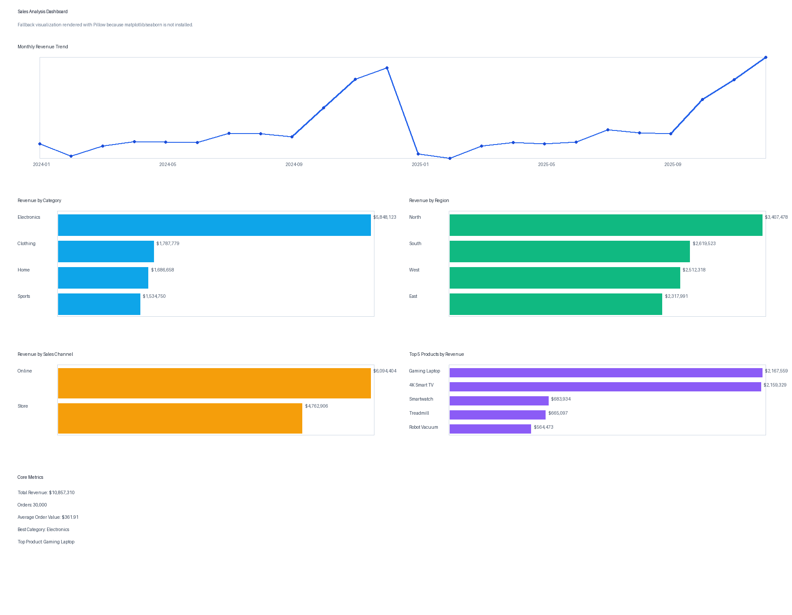
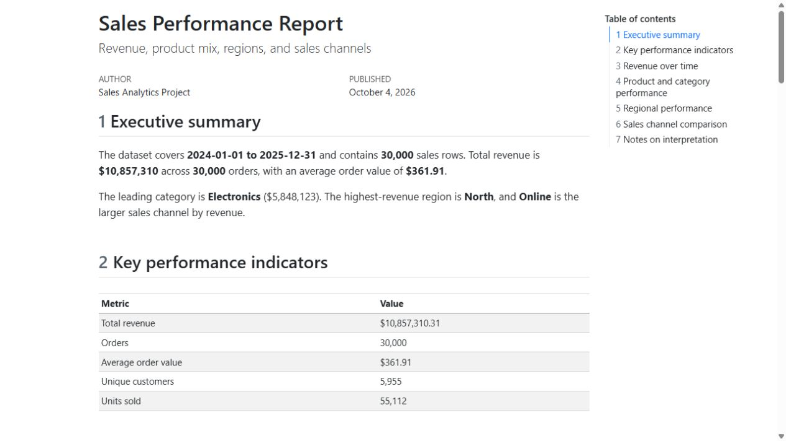
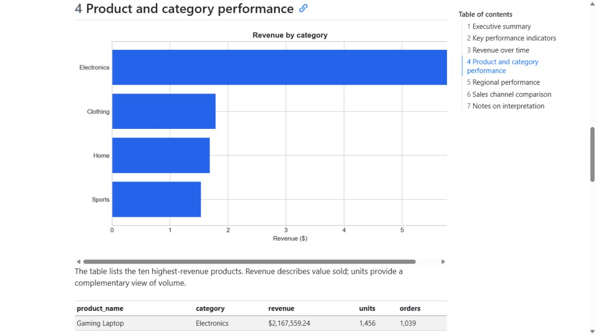
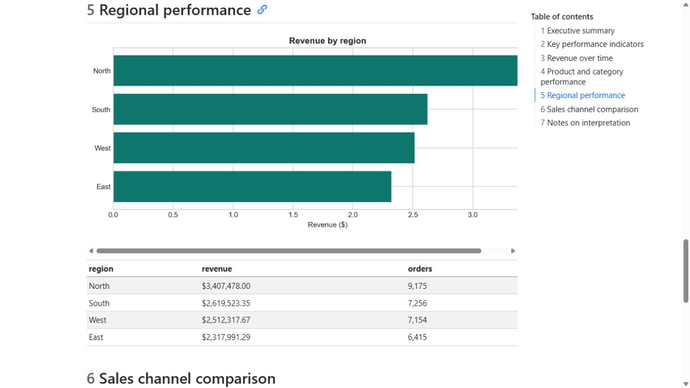
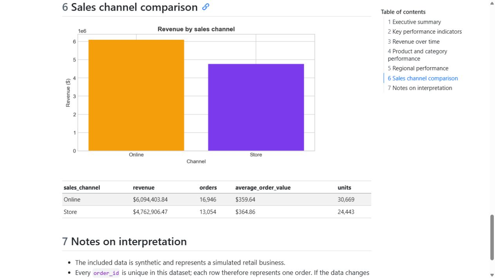

<div align="center">

# 📊 Retail Sales Analytics

### From synthetic transaction data to an interactive, reproducible Quarto report


[Overview](#project-overview) · [Analysis](#what-the-report-covers) · [Run it](#run-the-quarto-report) · [Structure](#project-structure)

</div>

---

## Project overview

This project explores how revenue, product mix, region, and sales channel change over time in a simulated retail business. It demonstrates a repeatable analytics workflow with **Python, pandas, SQLite, and Quarto**.

> **Data note:** The included 30,000-row dataset is synthetic. Results illustrate the analysis workflow and are not claims about a real retailer.

### At a glance

| Dataset | Period | Records | Deliverables |
|:--|:--|--:|:--|
| Simulated retail transactions | 2024–2025 | 30,000 | Quarto HTML report, SQLite database, CSV summaries, charts |

### Dashboard preview



### Quarto application screenshots

<table>
  <tr>
    <td align="center"><br><sub>Executive summary and KPIs</sub></td>
    <td align="center"><br><sub>Category performance and top products</sub></td>
  </tr>
  <tr>
    <td align="center"><br><sub>Regional comparison</sub></td>
    <td align="center"><br><sub>Online and store performance</sub></td>
  </tr>
</table>

### Project description PDF

[Pobierz polski opis projektu zaliczeniowego](output/pdf/opis_projektu_analizy_danych.pdf)

## What the report covers

The [Quarto report source](reports/sales_report.qmd) calculates its metrics and renders its charts from the source CSV whenever it runs.

- **Business performance:** revenue, orders, average order value, customers, and units sold
- **Trends:** monthly revenue and annual comparison
- **Sales mix:** product and category performance
- **Segments:** region and sales channel comparisons
- **Evidence:** inspectable tables alongside charts

The analysis focuses on questions such as which categories and products contribute most to revenue, whether performance varies across regions and channels, and how monthly sales change across the two-year period.

## Run the Quarto report

Install [Quarto](https://quarto.org/docs/get-started/) and Python 3.11. From the project root, create a virtual environment and install the dependencies:

```powershell
py -3.11 -m venv .venv
.venv\Scripts\Activate.ps1
python -m pip install -r requirements.txt
```

The Quarto Jupyter engine needs the Jupyter packages in the **same Python environment** that renders the report. They are included in `requirements.txt`. If you are installing them separately into your global Python 3.11 instead, use:

```powershell
py -3.11 -m pip install jupyter jupyter_client nbformat nbclient ipykernel traitlets
```

Render the report to HTML:

```powershell
quarto render reports/sales_report.qmd
```

The output is `reports/sales_report.html`. To preview the report and rerender after edits:

```powershell
quarto preview reports/sales_report.qmd
```

## Other workflows

Generate a fresh synthetic dataset:

```powershell
python scripts/generate_sales_data.py
```

Load the CSV into the normalized SQLite database:

```powershell
python scripts/load_to_sqlite.py
```

Generate the existing CSV summaries and PNG dashboard:

```powershell
python scripts/analyze_sales.py
```

The Quarto report reads the CSV directly. The SQLite database and SQL queries are available for database-focused analysis.

## Project structure

```text
data/                 Synthetic source CSV and SQLite database
dashboard/            Quarto report guide
outputs/              CSV summaries, dashboard image, and chart snapshots
output/pdf/           Polish project description PDF
reports/              Quarto report source (.qmd)
scripts/              Data generation, SQLite loading, and Python analysis
sql/                  Database schema and example analytical queries
requirements.txt      Python and Jupyter dependencies
```

## Data and metric definitions

- The data contains 30,000 rows dated from 2024-01-01 through 2025-12-31.
- Each `order_id` is unique in the included data, so each row represents one order.
- **Revenue** is the sum of `total_price`.
- **Orders** is the count of distinct `order_id` values.
- **Average order value** is revenue divided by distinct orders.
- Customer and product attributes are stored in separate SQLite dimension tables.

If the dataset is replaced with real data or multiple line items per order, review the data definitions and aggregation logic before interpreting the report.

## Academic use

This project can work well as a course project when the assignment covers exploratory or descriptive data analysis, visualization, KPI definition, or a reproducible reporting workflow. For a stronger submission, include the instructor's required question or hypothesis, explain data preparation and metric choices, and interpret the results in your own words. Since the bundled dataset is synthetic, use a real, citable dataset if the course requires empirical data or conclusions about an actual business.

## Extend the analysis

Edit `reports/sales_report.qmd` to add Python calculations, visualizations, and narrative. Each render re-executes the analysis using the current CSV. See the [Quarto report guide](dashboard/quarto_report_guide.md) for setup details.
